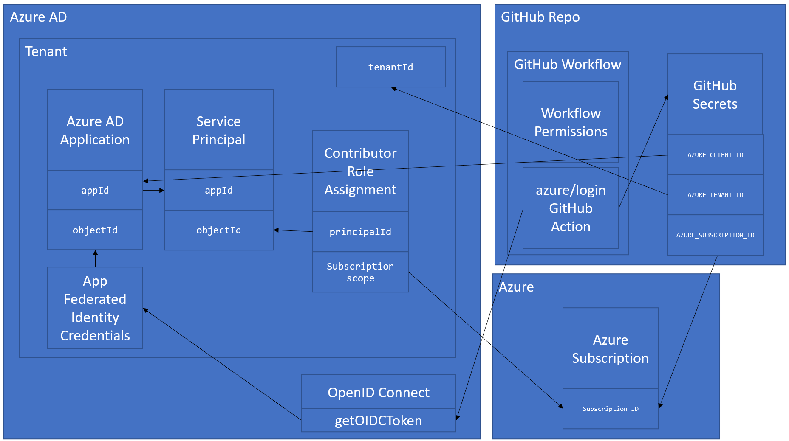

# Connect to Azure from a GitHub Action with OpenID Connect (OIDC)

GitHub recently released support to connect to Azure from a GitHub Action using Open ID Connect. This is helpful for when your GitHub action needs to perform operations on your Azure resources.  Like provisioning resources, deploying codes, etc.

In the past, you may have used `az ad sp create-for-rbac --sdk-auth` and stuffed that in a GitHub secret called `AZURE_CREDENTIALS` and used the `azure/login` action to authenticate with Azure. The downside to that approach is that you have to store the Service Principal password in the secret and when that changes or expires you have to update the GitHub secret with the new value.

With OIDC, you still use Azure AD and Service Principals, but you don't store the Service Principals password in the GitHub secret, you only store the clientId, tenantId, and subscriptionId and then when the GitHub workflow runs it will request a token from Azure AD using Federated Identity Credentials.

The official docs can be found here:
- Azure: https://docs.microsoft.com/en-us/azure/developer/github/connect-from-azure
- GitHub: https://docs.github.com/en/actions/deployment/security-hardening-your-deployments/configuring-openid-connect-in-azure

The docs get you close to having everything working, but it leaves a lot to be desired from a scripting perspective.  They have some sample Azure CLI commands, but they do not work as-is.  I have created a slew of issues to help get the docs update, but in the meantime - I hope this repo helps you get it all setup.


## How GitHub -> Azure OpenID Connect Works...in a nutshell

1. Azure AD Application
1. Azure Service Principal with Contributor access to Azure Subscription
1. Federated Identity Credentials (FIC) assigned to Azure AD Application
1. GitHub Workflow that:
    - Sets appropriate `permission` requirements
    - Uses the [`azure/login`](https://github.com/marketplace/actions/azure-login) Action to authenticate with Azure
1. GitHub Secrets that contain:
    - Azure AD Application ID (`AZURE_CLIENT_ID`)
    - Azure Tenant ID (`AZURE_TENANT_ID`)
    - Azure Subscription ID (`AZURE_SUBSCRIPTION_ID`)


When your GitHub Workflow is run it will use the `azure/login` Action and the GitHub Secrets to request an OIDC token from Azure AD.



## Azure Setup

You have two choices for provisioning and configuring these resources:

### Azure Portal

If you need to do it once or what to simply try it out, then use the Azure Portal instructions found here: https://docs.microsoft.com/en-us/azure/developer/github/connect-from-azure

### Azure CLI

If you want to automate to repeat the setup and config, then Azure CLI is the way to go.  Unfortunately, the docs today don't get you all the way there, so I created a script in this repo to help you get it set up. The team is working on fixing that experience, so look at this as a stop gap to help you get going.

You can find the script here: `./oidc.sh`.

It accepts three parameters:
 - APP_NAME - This is the name of the Azure AD app to be created.
 - REPO - This is the repo where you want to setup OIDC.
 - FICS_FILE - This is a path to the file that contains the Federated Identity Credential definitions that you want to create.

It will:
1. Create an Azure AD app if it doesn't exist
1. Create a new Service Principal and associate it with the Azure AD app
1. Assign Contributor role to the previously created Service Principal
1. Create Federated Identity Credentials for all of the FICs defined in `fics.json`  The Graph and Azure CLI teams are working on a better experience for this.
1. Set `AZURE_CLIENT_ID`, `AZURE_TENANT_ID`, and `AZURE_SUBSCRIPTION_ID` secrets in your GitHub repo.

# oidc.sh Script Setup

You can either open up the included DevContainer or run it locally.  

> NOTE: This doesn't work in GitHub Codespaces. See: https://github.com/Azure/login/issues/177

### Option 1: DevContainer

Open the DevContainer with VS Code Remote Container tools

### Option 2: Bare Metal

1. Install the [Azure CLI (v 2.30.0+)](https://docs.microsoft.com/cli/azure/install-azure-cli)
  1. Login to Azure CLI `az login`
  1. Make sure correct sub is set with `az account show`, `az account set`
1. Install [GitHub CLI](https://github.com/cli/cli) - To create the secrets

# Run it
So for example, you can clone this repo and run:

```bash
./oidc.sh testappname1 jongio/github-azure-oidc ./fics.json
```

> Change the APP_NAME and REPO params to something unique and the repo you want to target.

# Add azure/login step to your GitHub Action
Check out the workflow file in this repo `.github/workflows/ci.yml` for an example.  You can use that as a starting point for your GitHub action.

# Follow ups
I hoping that this functionality gets integrated into the Azure or GitHub CLI, but in the meantime, this should help you out.
